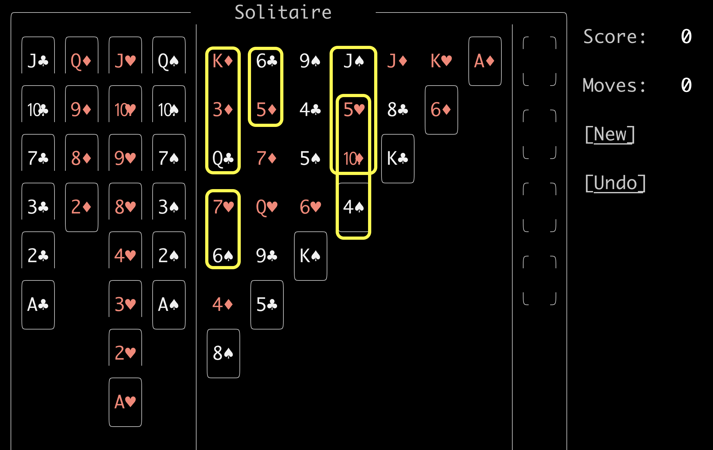
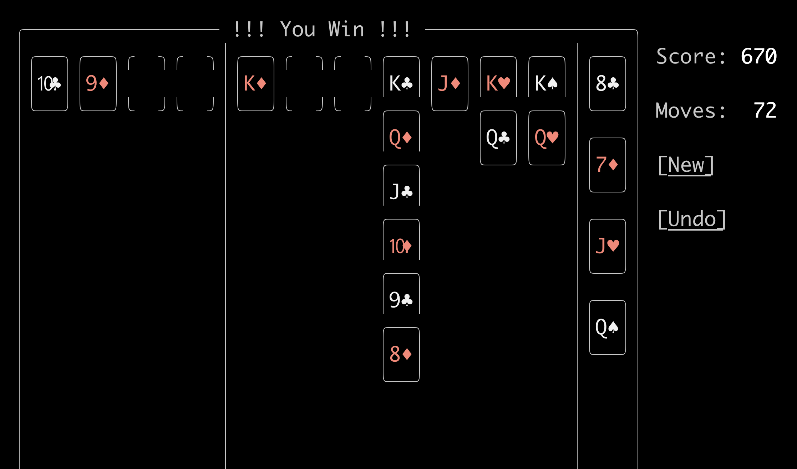

# Played Game 5

This game was tough but playable.

## Summary

1. As shown by the yellow bands, there are 5 half-blockages.
1. There are no full blockages.

### Initial Play

Move all of the *aces* and the *2s* from wherever they are to the *foundation*.

### Open the 5❤️ by getting the 4♠️ out of the way

1. Move the 3♠️ from the *waste* to the *foundation*.
1. Move the 4♠️ to the *foundation*.

### Open the J♠️ by getting the 10♦️ out of the way

1. Move 5♣️ to the 6♦️.
1. Move Q♦️ from *waste* to K♣️.
1. Move J♣️ from *waste* to Q♦️.
1. Move 10♦️ to J♣️.

### Open tableau column 2

1. Move 9♣️ to 10♦️.
1. Move Q❤️ to K♠️.

### Move J♠️ to Q❤️

1. Move K♠️ to *tableau* column 7 row 1.
1. Move 8♦️ from *waste* to 9♣️.
1. Move 7♠️ from *waste* to 8♦️.
1. Move 6♦️ to 7♠️.
1. Move 3❤️ from *waste* to *foundation*.
1. Move 4❤️ from *waste* to *foundation*.
1. Move 5❤️ to *foundation*.
1. Move J♠️ to Q❤️.

### Expose Q♣️

1. Move Q♠️ from *waste* to K❤️.
1. Move J❤️ from *waste* to Q♠️.
1. Move 10♠️ from *waste* to J❤️.
1. Move 9❤️ from *waste* to 10♠️.
1. Move 8♠️ to 9❤️.
1. Move 4♦️ to 5♣️.
1. Move 7♦️ to 8♠️.
1. Move 6♠️ to 7♦️.
1. Move 6❤️ to *foundation*.
1. Move 10❤️ from *waste* to J♠️.
1. Move K♣️ from *tableau* column 3 row 5 to column 4 row 1.
1. Move 5♠️ to *foundation*.
1. Move 3♣️ from *waste* to *foundation*.
1. Move 4♣️ to *foundation*.
1. Move 9♠️ to 10❤️.
1. Move 5♦️ to 6♠️.
1. Move 6♣️ to 7❤️.
1. Move 5♦️ from 6♠️ to 6♣️.
1. Move 6♠️ to the *foundation*.
1. Move 6♣️ from 7❤️ to 7♦️.
1. Move 7❤️ to 8♣️.

### Play out the Foundatation to get to the Q♣️

1. Move 8❤️ from *waste* to 9♠️
1. Move 7♣️ from *waste* to 8❤️.
1. Move 6♦️ from 7♠️ to 7♣️.
1. Move 7♠️ to the *foundation*.
1. Move 7♦️ from 8♠️ to 8♣️.
1. Move 8♠️ to the *foundation*.
1. Move 7♣️ from 8❤️ to 8♦️.
1. Move 8❤️ to *foundation*.
1. Move 9♠️ to *foundation*.
1. Move 9❤️ to *foundation*.
1. Move 10❤️ to *foundation*.
1. Move 10♠️ to *foundation*.
1. Move J♠️ to *foundation*.
1. Move J❤️ to *foundation*.
1. Move Q♠️ to *foundation*.

### The End Game

1. Move Q♣️ to K❤️.
1. Move 3♦️ to *foundation*.
1. Move 4♦️ to *foundation*.
1. Move 5♣️ to *foundation*.
1. Move 5♦️ to *foundation*.
1. Move 6♣️ to *foundation*.
1. Move 6♦️ to *foundation*.
1. Move 7♣️ to *foundation*.
1. Move 7♦️ to *foundation*.
1. Move 8♣️ to *foundation*.

And the last facedown card, the J♦️, is revealed and the game is won.

