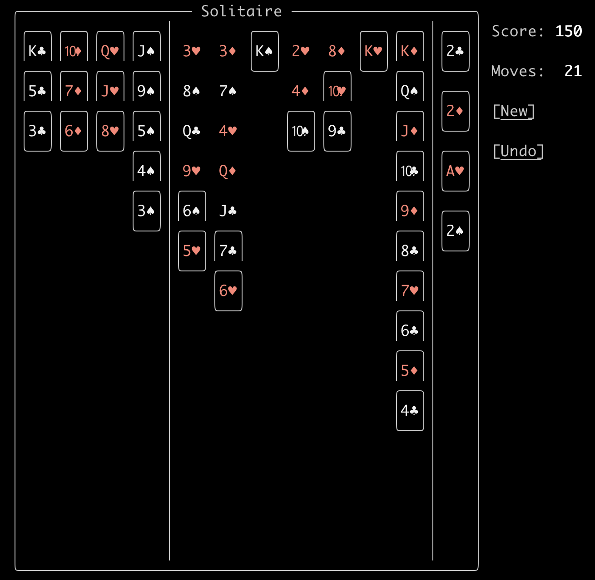
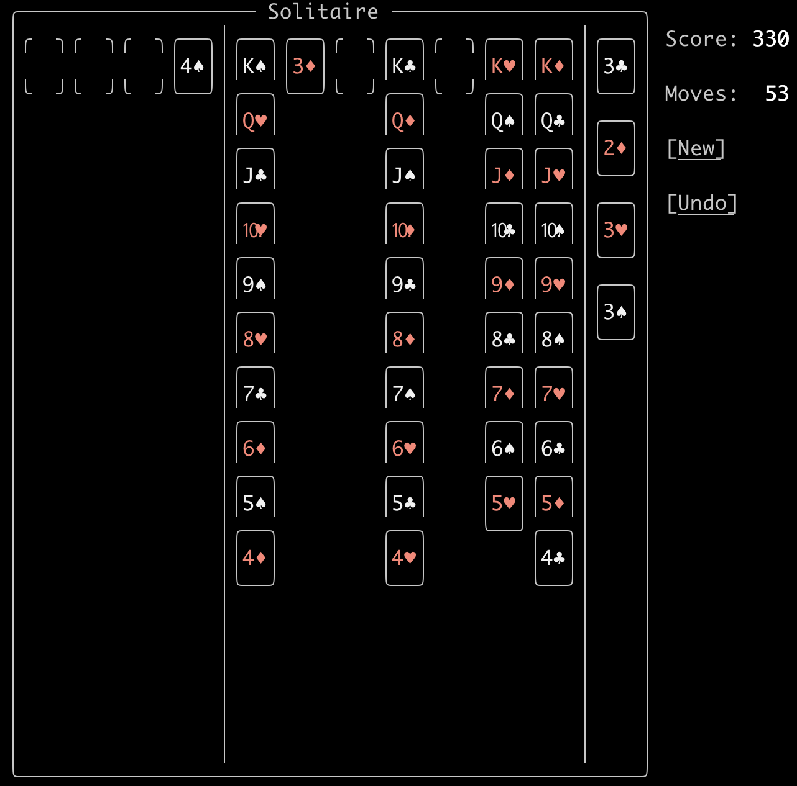
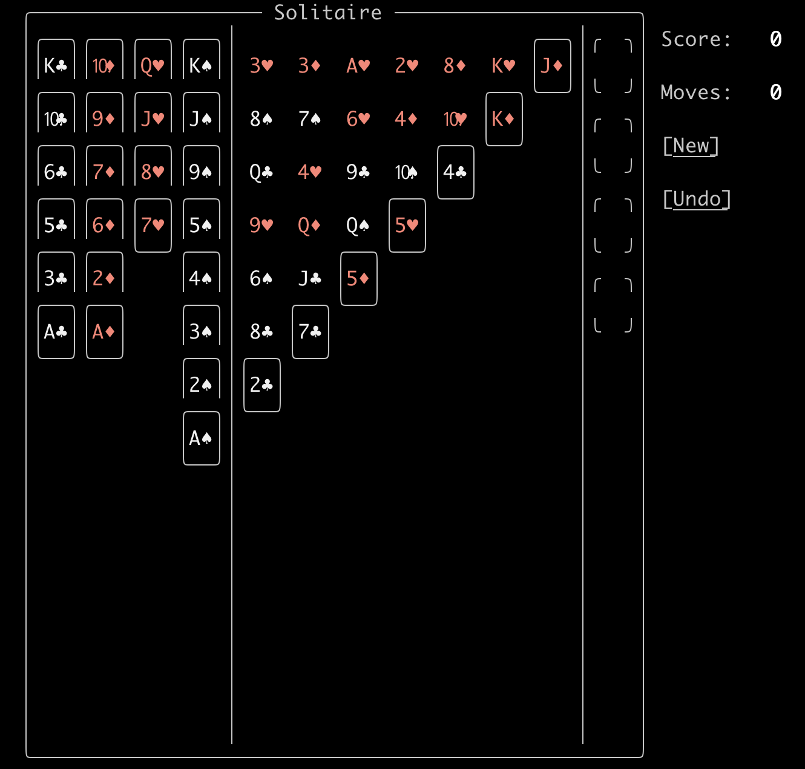

# Locked Game Example 2

Here's an example of a *probable* unsolveable card deal:

1. I worry about the low value cards at the top row of the *tableau*:
    * The 3 cards in cols **1** and **2**.
    * The 2❤️ in col **4**.
    * These essentially block any *foundation* growth on the red cards.
1. The black **queens** are inaccessible in the tableau:
    * The **Q♣️** in column **1** is blocked by the **6♠️**.
    * The **6♠️** cannot move because it is blocking the 9❤️ above it from being able to be moved to the **10♠️** in column **4** where it could eventually provide the 7❤️ to be moved to.
1. The **J♣️** cannot move because it needs the Q♦️ above it.

Nope, this is a playable game.  Here's the finish:

Here are the *undo* moves back:

* 7♣️ 3♦️
* 3♦️ 4♣️
* 3♣️ 4♦️
* 2❤️ 3♣️
* A❤️ empty 3rd tableau column
* 7♠️ 3♦️
* 4❤️ 7♠️
* 5♣️ waste
* 8♦️ empty 5th tableau column
* 9♣️ 6❤️
* Q♠️ 9♣️
* K♦️ K❤️
* J♦️ empty 7th tableau column
* 5♦️ Q♠️
* 6♣️ waste
* 7❤️ waste
* 10♦️ waste
* J♠️ waste
* Q♦️ 4❤️
* K♣️ waste
* 4♠️ waste
* *dammit, missed it! Guessing 3♣️ from foundation to 4♦️?*
* 4♦️ 2❤️
* 5♠️ waste
* 6♦️ waste
* 10❤️ 8♦️
* J♣️ Q♦️
* Q❤️ waste
* 7♣️ J♣️
* 8❤️ waste
* 9♠️ waste
* K♠️ waste
* 3❤️ empty 1st tableau column
* 3♠️ waste
* 3♣️ waste
* 8♠️ 3❤️
* Q♣️ 8♠️
* 10♠️ 4♦️
* J❤️ waste
* 9❤️ Q♣️
* 6♠️ 9❤️
* 7♦️ waste
* 5❤️ 10♠️
* 4♣️ 10❤️
* 8♣️ 6♠️
* 9♦️ waste
* 10♣️ waste
* 2♣️ 8♣️
* 2♦️ waste
* 2♠️ waste
* A♠️ waste
* A♦️ waste
* A♣️ waste

Which takes us back to the original deal:

