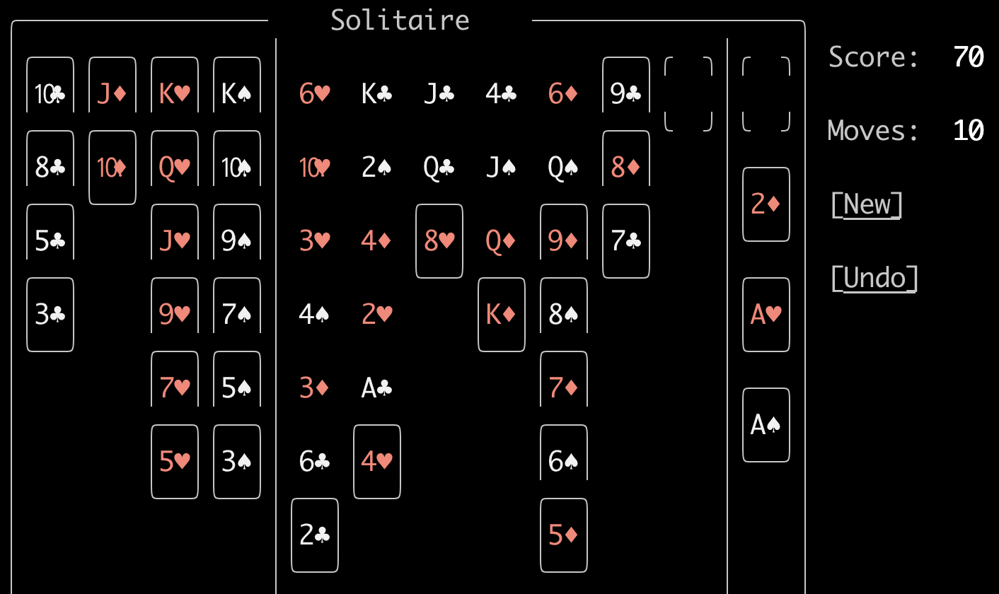

# Locked Game Example #3

1. The most notable problem is in the *tableau* column 1 where 3❤️ or 3♦️ are blocking the 2♣️ card at the bottom.
1. Can we move the 2♣️ to the *foundation*? Only if the A♣️ can be exposed in column 2.
1. Unfortunately, the A♣️ is blocked by the 4❤️.
1. If the 5♣️ or 5♠️ were in the *tableau*, the 4❤️ could be moved there; unfortunately both of them are still in the *waste*.
1. But we can't move the 5♣️ or 5♠️ out of the *waste* because they need the 6❤️ or 6♦️ to be exposed. Unfortunately, they are buried at the top row in columns 1 and 5.
1. Can we get access to the 6♦️? This would require moving the 9♦️ two rows below it.
1. Unfortunately, this would require the 10♣️ or 10♠️ in the *waste* which mean they have to be moved to the J♦️ or J❤️.
1. But the J♦️ or J❤️ would are still in the *waste*, so they need to be moved to the Q♣️ or Q♠️.
1. The Q♣️ is blocked by the 8❤️ below it has nowhere to be moved because it needs the 9♠️ in the *tableau* which needs the 10♦️ (also in the *tableau*) which needs the J♣️ (blocked by the unmoveable Q♣️) or the J♠️ (blocked by the unmoveable Q♦️).  The Q♦️ is unmovable because, although the K♦️ can be moved to the empty column 7, there is no K♣️ or K♠️ to move it to.

Hence the game is unsolveable.

Potentially, the game could be prechecked as follows:

* For each *tableau* check to see if the playable card is potentially blocked:
    * Its 2 attachment cards are already in the same *tableau* column above it.
    * Its *foundation* target (including the ace) is currently unplayable in the *tableau*.
    * All currently playable *tableau* cards are unable to provide a target because their resulting parent values will be the wrong color.  For example, the 4❤️ above can never be played on any derivative of the following playable *tableau* cards:
        * 7♦️
        * 5♦️
        * 9♦️
        * K♦️
        * 8♠️
        * 4❤️ The card attempting to be moved
        * 2♣️

Starting to have an algorithm:

For each playable card in the *tableau*:

* If an ace, move to *foundation*.
* If a 2 and its ace is in the *foundation*, then move it to the *foundataion*.
* If two cards are playable to the same *tableau* target, then choose the one that enables the most subsequent *tableau* moves.

For each blocked playable *tableau* card:

* Can a sequence of *waste* cards be played to the *tableau* or *foundatation* to a playable card so that the blocked card can be played?
* If yes, then this is a possible action.
* If no, then this is still blocked.
* In any case, go to the next blocked card and repeat this check
